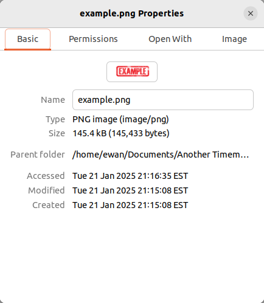
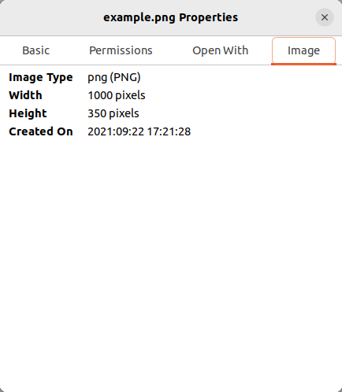

# timemod.sh

timemod.sh is a bash script which, utilising the exiftool command-line application, 'changes' the creation times of images with each creation time 
between 5 and 14 seconds of the last; e.g. the first image has its creation time 'changed' to 2021:09:22 17:04:16, then the second image's creation time is 'changed' to 2021:09:22 17:04:22, then the third 2021:09:22 17:04:36, then the fourth 2021:09:22 17:04:47 and so on.

## Table of Contents

- [Prerequistes](#prerequisites)
- [Installation](#installation)
- [Usage](#usage)
- [Notes](#notes)

## Prerequisites

1. Ubuntu Linux (and probably most other Linuxes too)

    You can set up a virtual machine using VirtualBox or VMWare if you don't want to install Linux on your machine. <a href="https://www.virtualbox.org/wiki/Downloads" target="_blank">You can download Virtualbox here</a>

    <a href="https://ubuntu.com/tutorials/how-to-run-ubuntu-desktop-on-a-virtual-machine-using-virtualbox#1-overview" target="_blank">And here's how to set up an Ubuntu virtual machine on Virtualbox</a>

2. Install exiftool:

    Open a Terminal and run the following:
```bash
sudo apt install exiftool
```

3. Add the directory to which you installed exiftool to your PATH
    Open ~/.profile with your favourite text editor and modify the line that starts with 'PATH=' to PATH="$PATH:/usr/bin" (if /usr/bin is where exiftool is 
installed to). Save the file then reboot.

## Installation

1. Open a terminal and run the following:
```bash
git clone https://github.com/ebl138/timemod.sh.git
```

Or click into 'timemod.sh' above and click the 'Download raw file' icon at the top right.

2. Ensure timemod.sh is in the same directory as the images you want to modify.

## Usage

```bash
bash timemod.sh 2021:09:22 17:04:16
```

## Notes

You'll notice that the 'Accessed', 'Modified' and 'Created' attributes (as shown below) are not the date and time you set using the timemod.sh script but the current date and time; this is because these are filesystem attributes and not part the internal file metadata. There's an option to change the 'Accessed' and 'Modified' attribute values using the '-FileModifyDate' flag but it isn't possible to change the 'Created' attribute value; feel free to add the flag back to the exiftool command though, however.



The 'Created On' metadata tag will be set to the date and time you set using timemod.sh:

